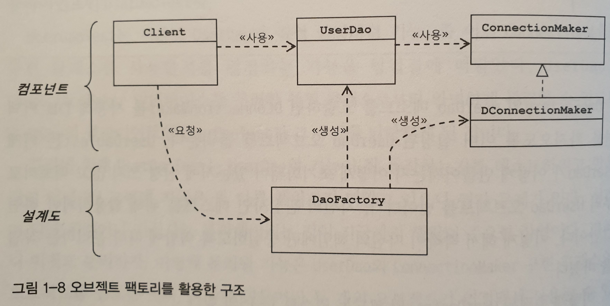
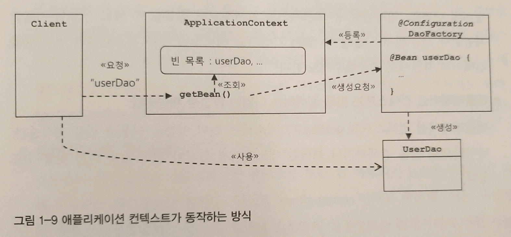
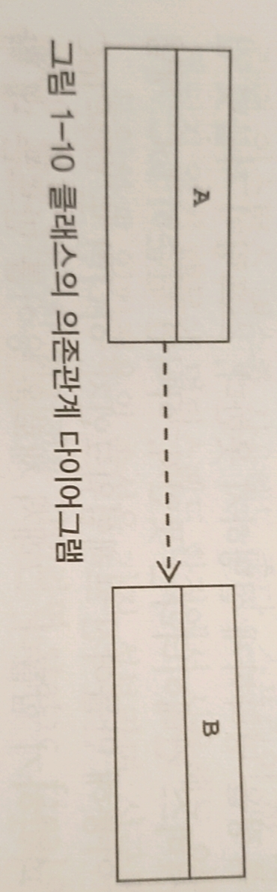
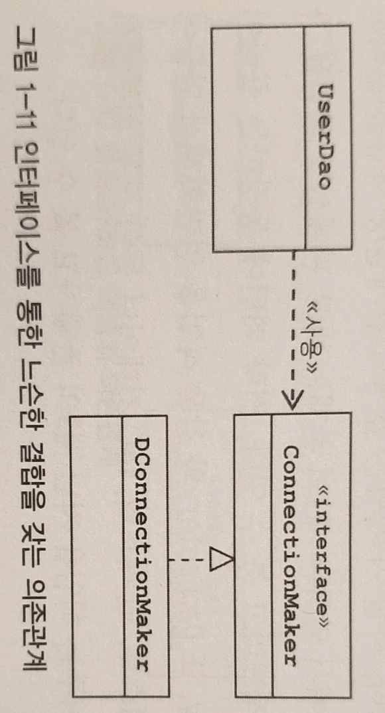

# 1장 오브젝트와 의존관계

---

다음 두 가지 관례를 따라 만들어진 오브젝트를 자바빈이라고 부른다.

1. 디폴트 생성자 : 자바빈은 파라미터가 없는 디폴트 생성자를 가지고 있어야 한다. 툴이나 프레임워크에서 리플렉션을 이용해 오브젝트를 생성하기 때문에 필요하다.
2. 프로퍼티 : 자바빈이 노출하는 이름을 가진 속성을 프로퍼티라고 한다. 프로퍼티는 set으로 시작하는 수정자 메서드(setter)와 get으로 시작하는 접근자 메서드(getter)를 이용해 수정 또는 조회할 수 있다. 

# 1.4 제어의 역전(Inversion of Control)

---

## 1.4.1 오브젝트 팩토리

### 팩토리

- 객체의 생성 방법을 결정하고 그렇게 만들어진 오브젝트를 돌려주는 역할을 하는 클래스
- 어떻게 만들지와 어떻게 사용할지는 다른 관심사이므로 객체를 사용하는 것과 이용하는 것은 분리해야 한다.

    public class DaoFactory {
    	public UserDao userDao() {
    		ConnectionMaker connectionMaker = new DConnectionMaker();
    		User Dao = new UserDao(connectionMaker);
    		return userDao;
    	}
    }
    
    
    public class UserDaoTest {
    	// blah blah code
    	UserDao dao = new DaoFactory().userDao();
    
    }

> 팩토리를 이용하면 구조를 결정하는 설계와 실제 실행되는 기능을 구분할 수 있다.

## 1.4.2 오브젝트 팩토리의 활용

DaoFactory에 Dao 생성 메서드가 추가될 경우 중복 코드가 발생할 수 있다.  아래의 코드에서는 connection을 만들어주는 `new DConecctionMaker()` 코드가 중복되고 있다. 

    public class DaoFactory {
    	public UserDao userDao() {
    		User dao= new UserDao(new DConnectionMaker());
    		return dao;
    	}
    
    	public ArticleDao() {
    		article dao= new ArticleDao(new DConnectionMaker());
    		return dao;
    	}
    
    	public CommentDao() {
    		Comment dao= new CommentDao(new DConnectionMaker());
    		return dao;
    	}
    }

중복제거에는 역시 분리가 짱이다. 아래처럼 connection을 만들어주는 기능을 메서드로 분리하자 중복이 제거되었다. 

    public class DaoFactory {
        	public UserDao userDao() {
        		User dao= new UserDao(connectionMaker());
        		return dao;
        	}
        
        	public ArticleDao() {
        		article dao= new ArticleDao(connectionMaker());
        		return dao;
        	}
        
        	public CommentDao() {
        		Comment dao= new CommentDao(connectionMaker());
        		return dao;
        	}
    
    	public ConnectionMaker connectionMaker() {
    		return new DConnectionMaker();
    	}
    }

## 1.4.3 제어권의 이전을 통한 제어관계 역전

### What is 제어의 역전?

프로그램의 제어 흐름 구조가 뒤바뀌는 것!

일반적인 프로그램 제어 흐름의 구조

- 오브젝트가 능동적으로 자신이 사용할 클래스를 결정하고, 생성하고, 생성한 오브젝트의 메서드를 호출한다. 모든 종류의 작업을 `사용하는 쪽에서 제어`하는 구조.

이를 뒤바꾸면 `제어의 역전`

- 오브젝트가 자신이 사용할 오브젝트를 스스로 선택하지 않는다. 생성하지도 않는다.
- 자기 자신도 언제 어떻게 생성되어 어디에서 어떻게 사용될지 모른다.
- 모든 오브젝트는 제어 권한을 가지고 있는 `특별한 오브젝트에 의해 결정`되고 만들어진다.

### 라이브러리와 프레임워크의 차이

- 라이브러리를 사용하는 애클리케이션 코드는 애플리케이션 흐름을 직접 제어한다. 동작하는 도중에 필요한 기능이 있을 때 라이브러리를 사용할 뿐이다.
- 프레임워크는 애플리케이션 코드가 프레임워크에 의해 사용된다. 프레임워크에는 제어의 역전 개념이 적용되어 있어야 한다.

능동적으로 작업을 수행하던 오브젝트가 사용되어지고 생성되어지는 부품, 조각의 역할을 하게 하는 것. 이라고 느껴진다.

# 1.5 스프링의 IoC

---

`Bean Factory`와 `Application Context`가 스프링의 핵심!

## 1.5.1 오브젝트 팩토리를 이용한 스프링 IoC

### 애플리케이션 컨텍스트와 설정정보

- Bean : 스프링 컨테이너가 제어권을 가지고  생성과 관계설정, 사용 등을 제어하는 제어의 역전이 적용된 오브젝트
- Bean Factry : 빈의 생성과 관계절성 같은 제어를 담당하는 IoC 오브젝트

일단은, 애플리케이션 컨텍스트와 빈 팩토리를 동일하다고 생각하자. 

건물이 설계도면을 따라서 만들어지듯이, 애플리케이션도 애플리케이션 컨텍스트와 그 설정정보를 따라서 만들어지고 구성된다.

- @Configuration : 애플리케이션 또는 빈 팩토리가 사용할 설정정보라는 표시
- @Bean : 오브젝트 생성을 담당하는 IoC용 메서드라는 표시

    @Configuration
    public class DaoFactory {
    	@Bean
    	public UserDao userDao() {
    		return new UserDao(connectionMaker());
    	}
    
    	@Bean
    	public ConnectionMaker connectionMaker() {
    		return new DconnectionMaker();
    	}
    }
    
    
    
    public class UserDaoTest {
    	public static void main(String[] args) {
    		ApplicationContext context = new AnnotaionConfigApplicationContext(DaoFactory.class);
    		UserDao dao = context.getBean("userDao", UaserDao.class);
    		// getBean("bean으로 등록된 메서드 이름", 리턴 받을 오브젝트)
    	}
    }

## 1.5.2 애플리케이션 컨텍스트의 동작방식

`빈 팩토리`, `애플리케이션 컨텍스트`를 `IoC 컨테이너`, `스프링 컨테이너`라고 부른다. 

오브젝트 팩토리를 만들어 사용하지 않고 애플리케이션 컨텍스트를 이용했을 때 얻을 수 있는 장점.

1. 클라이언트는 구체적인 팩토리 클래스를 알 필요가 없다. 
    - 애플리케이션 컨텍스트를 이용하면 일관된 방식으로 원하는 오브젝트를 가져올 수 있다.

2. 애플리케이션 컨텍스트는 종합 IoC 서비스를 제공해준다.
    - 오브젝트의 생성과 관계설정 뿐만이 아니라 다양한 서비스를 제공한다.

 3. 애플리케이션 컨텍스트는 빈을 검색하는 다양한 방법을 제공한다.

애플리케이션 컨텍스트는 오브젝트의 생성 및 관리, 관계설정 뿐만 아니라 다양한 서비스, 기능을 제공한다고 한다. 지금이야 직접 오브젝트를 생성하지 않고 바로 주입받아 사용할 수 있다는 장점 외에 다른 기능을 사용해보지 않아 스프링의 장점보다는 학습 비용이 더 커보인다. 스프링의 효용은 더 사용해봐야 느낄 수 있을 것 같다.

## 1.5.3 스프링 IoC의 용어 정리

1. 빈

    스프링이 IoC 방식으로 관리하는 오브젝트. 스프링을 사용하는 애플리케이션에서 만들어지는 모든 오브젝트가 다 빈이 아니다. `스프링이 직접 생성과 제어를 담당하는 오브젝트`만을 빈이라고 부른다.

2. 빈 팩토리

빈을 등록하고, 생성하고, 조회하고 돌려주고, 그 외에 부가적인 빈을 관리하는 기능을 담당한다. 

3.  애플리케이션 컨텍스트

빈 팩토리를 확장한 IoC 컨테이너. 빈을 등록하고 관리하는 기본적인 기능은 빈 팩토리와 동일하다. 여기에 스프링이 제공하는 각종 부가 서비스를 추가로 제공한다. 

4. 설정정보/설정 메타정보

애플리케이션 컨텍스트 또는 빈 팩토리가 IoC를 적용하기 위해 사용하는 메타정보를 말함.

애플리케이션 컨텍스트라는 엔진이 설정정보/ 설정 메타정보라는 규격사항을 가지고 빈이라는 부품을 사용해 애플리케이션을 구동시킨다.

# 1.6 싱글톤 레지스트리와 오브젝트 스코프

---

### 동일성과 동등성은 다르다.

동일성 : 동일한 오브젝트.

동등성 : 오브젝트가 가지고 있는 정보는 같지만 각각의 오브젝트가 다른 메모리에 존재하는 것. 

동일한 오브젝트는 동등하지만 동등한 오브젝트는 항상 동일하지는 않다. 

자바 클래스를 만들 때 따로 equals()를 구현하지 않았다면 최상위 클래스인 Obejct 클래스에 구현되어 있는 euqals() 메서드가 사용된다. Object 클래스에 구현되어 있는 equals()메서드는 동일성을 비교한다. 

스프링은 동일한 오브젝트를 돌려준다. 매번 `new Dao();`하지 않는다.

## 1.6.1 싱글톤 레지스트리로서의 애플리케이션 컨텍스트

애플리케이션 컨텍스트는 `싱글톤 레지스트리`이다.

### 싱글톤 패턴의 문제점

1. **private 생성자를 갖고 있기 때문에 상속할 수 없다**.

    객체지향의 장점인 상속과 이를 이용한 다형성을 적용할 수 없다. 

2. **싱글톤은 테스트하기가 힘들다.**
3. **서버환경에서는 싱글톤이 하나만 만들어지는 것을 보장하지 못한다**.

    서버에서 클래스 로더를 어떻게 구성하고 있느냐에 따라서 싱글톤 클래스임에도 하나 이상의 오브젝트가 만들어질 수 있다. 여러 개의 JVM에 분산돼서 설치가 되는 경우에도 각각 독립적으로 오브젝트가 생기기 때문에 싱글톤으로서의 가치가 떨어진다. 

4. **싱글톤의 사용은 전역 상태를 만들 수 있기 때문에 바람직하지 못하다.**

    아무 객체나 자유롭게 접근하고 수정하고 공유할 수 있는 전역 상태를 갖는 것은 객체지향 프로그래밍에서는 권장되지 않는 프로그래밍 모델이다 

### 싱글톤 레지스트리

자바의 싱글톤 패턴의 구현은 여러 가지 단점이 있기 때문에, 스프링은 직접 싱글톤 형태의 오브젝트를 만들고 관리하는 기능을 제공한다. 

싱글톤 레지스트리는 스태틱 메서드와 private 생성자를 사용해야 하는 비정상적인 클래스가 아니라 `평범한 자바 클래스를 싱글톤으로 활용`하게 해준다. public 생성자를 가질 수 있기 떄문에 테스트 환경에서 자유롭게 오브젝트를 만들 수 있다. 

### 싱글톤이기에 주의해야 할 점

1. 싱글톤이 멀티스레드 환경에서 서비스 형태의 오브젝트로 사용되는 경우에는 상태정보를 내부에 갖지 않는 무상태(stateless) 방식으로 만들어져야 한다. 
2. 각 요청에 대한 정보나 DB나 서버의 리소스로부터 생성한 정보는 파라미터와 로컬 변수, 리턴 값 등을 이용해 다룬다. 
3. 읽기전용의 속성을 가진 정보라면 싱글톤에서 인스턴스 변수로 사용해도 좋다. static final이나 final로 선언해서 사용하자.

## 1.6.3 스프링의 빈 스코프

빈 스코프 :

스프링이 관리하는 오브젝트, 즉 빈이 생성되고, 존재하고, 적용되는 범위. 

싱글톤 스코프

- 기본 스코프는 싱글톤. 싱글톤 스코프는 컨테이너 내에 한 개의 오브젝트만 만들어진다.

프로토타입 스코프

- 컨테이너에 빈을 요청할 때마다 매번 새로운 오브젝트를 만들어준다.

요청(request) 스코프

- HHTP요청이 생길때마다 오브젝트를 생성한다.

스프링은 기본적으로 빈 오브젝트를 싱글톤 스코프로 관리한다. 스프링 컨테이너에 한 개의 빈 오브젝트만 생성해놓고 요청이 생길때마다 갖은 오브젝트를 리턴해준다. 때문에 싱글톤으로 관리되는 오브젝트는 stateless해야 하며 읽기전용의 속성은 static final 혹은 final로 선언해 관리하는 것이 좋다.

# 1.7 의존관계 주입(DI)

---

## 1.7.1 제어의 역전(IoC)과 의존관계 주입

DI는 오브젝트 레퍼런스를 외부로부터 제공(주입)받고 이를 통해 여타 오브젝트와 다이내믹하게 의존관계가 만들어지는 것이 핵심이다. 

## 1.7.2 런타임 의존관계 설정

### 의존관계

A가 변하면 B에 영향을 미칠 때, B는 A에 의존하고 있다고 말한다.  B가 A를 내부적으로 사용하고 있을 경우 '사용에 대한 의존관계'가 있다고 말할 수 있다. 

A 클래스가 B 클래스에 의존하고 있다.

ConnectionMaker 인터페이스를 사용함으로써 UserDao와 DConnectionMaker의 결합도를 낮추었다. 의존도를 낮추었다. DConnectionMaker가 변경되어도 UserDao는 ConnectionMaker 인터페이스를 의존하고 있기 때문에 UserDao는 영향을 받지 않는다.

### 의존관계 주입의 조건

1. 클래스 모델이나 코드에는 런타임 시점의 의존관계가 드러나지 않는다. 그러기 위해서는 인테퍼에스에만 의존하고 있어야 한다.
2. 런타임 시점의 의존관계는 컨테이너나 팩토리 같은 제3의 존재가 결정한다.
3. 의존관계는 사용할 오브젝트에 대한 레퍼런스를 외부에서 제공(주입)해줌으로써 만들어진다.

의존관계 주입의 핵심은 설계 시점에는 알지 못했던 두 오브젝트의 관계를 맺도록 도와주는 제3의 존재가 있다는 것이다. 

    // 의존관계 주입을 위한 코드
    public class UserDao{
    	private ConnectionMaker connectionMaker;
    
    	public UserDao(ConnectionMaker connectionMaker) {
    		this.connectionMaker = connectionMaker;
    	}
    }

## 1.7.3 의존관계 검색과 주입

의존관계 검색은 자신이 필요로 하는 의존 오브젝트를 능동적으로 찾는다.

의존관계 검색은 런타임 시 의존관계를 맺을 오브젝트를 결정하는 것과 오브젝트의 생성 작업은 외부 컨테이너에게 IoC로 맡기지만, 이를 가져올 때는 메소드나 생성자를 통한 주입 대신 스스로 컨테이너에게 요청하는 방법을 사용한다.

### 의존관계 검색보다는 의존관계 주입이 낫다.

의존관계 검색 방법은 코드 안에 오브젝트 팩토리 클래스나 스프링 API가 나타난다.

    public class UserDaoTest {
    	ConnectionMaker connectionMaker;
    
    	ApplicationContext context = new AnnotaionConfigApplicationContext(DaoFactory.class);
    	this.connectionMaker = context.getBean("connectionMaker", ConnectionMaker.class);
    }

애플리케이션 컴포넌트가 컨테이너와 같이 성격이 다른 오브젝트에 의존하게 되는 것이므로 그다지 바람직하지 않다. 따라서 대개는 의존관계 주입 방식을 사용하는 편이 낫다.

### 의존관계 검색과 의존관계 주입의 차이점

의존관계 검색 방식에서는 검색하는 오브젝트는 자신이 스프링의 빈일 필요가 없다. 

DI를 원하는 오브젝트는 먼저 자기 자신이 컨테이너가 관리하는 빈이 돼야 한다!!!

Di에서 말하는 주입은 다이내믹하게 구현 클래스를 결정해서 제공받을 수 있도록 인터페이스 타입의 파라미터를 통해 이뤄져야 한다. 

## 1.7.4 의존관계 주입의 응용

### DI 장점 정리

코드에는 런타임 클래스에 대한 의존관계가 나타나지 않고, 인터페이스를 통해 결합도가 낮은 코드를 만들므로, 다른 책임을 가진 사용 의존관계에 있는 대상이 바뀌거나 변경되더라도 자신은 영향을 받지 않으며, 변경을 통한 다양한 확장 방법에는 자유롭다.

### 기능 구현의 교환

실제 운영에 사용하는 데이터베이스와 개발시에 사용하는 데이터베이스는 달라야 하는데 의존관계를 주입해서 사용한다면 단 한 줄의 변경으로 개발과 운영시에 데이터베이스를 다르게 사용할 수 있다.

    @Bean
    public ConnectionMaker connectionMaker() {
    	return new LocalDBConnection();
    }
    
    @Bean
    public ConnectionMaker connectionMaker() {
    	return new ProductionDBConnectionMaker();
    }

## 1.7.5 메서드를 이용한 의존관계 주입

- 수정자 메서드를 이용한 주입 (setter)

    가장 많이 사용되는 방법

- 일반 메서드를 이용한 주입

    여러 개의 파라미터를 갖는 일반 메서드를 이용한 주입

    의존관계 주입을 사용하면 의존관계를 갖는 클래스 간에 결합도를 낮출 수 있다. 의존관계를 주입하는 방법에는 의존관계 주입과 의존관계 검색이 있다. 의존관계 검색은 의존관계를 검색하는 오브젝트가 스프링이 관리하는 Bean일 필요가 없다는 특징이 있지만 코드 안에 스프링 API가 들어있다는 점에서 SRP의 원칙에 위배된다.  의존관계를 주입하는 방법에는 생성자 주입, 수정자 메서드를 이용한 주입, 일반 메서드를 이용한 주입이 있다. 이 중, 수정자 메서드를 이용한 주입을 가장 많이 사용한다.
    
> https://www.notion.so/sooreal/2019-07-29-1-39d933b443f94bb7a3bf144551f959fd
