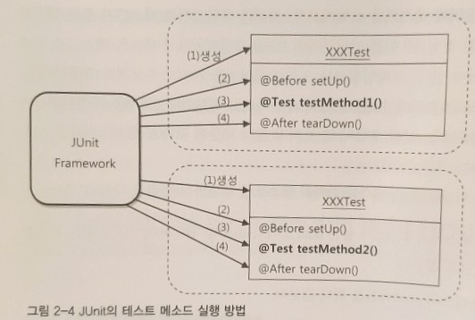

# 2장 테스트

---

> 스프링이 개발자에게 제공하는 가장 중요한 가치가 무엇이냐고 질문한다면 나는 주저하지 않고 `객체지향`과 `테스트`라고 대답할 것이다.

- 테스트 기술은 코드를 확신할 수 있게 해주고, 변화에 유연하게 대처할 수 있는 자신감을 준다.

- 테스트란 결국 내가 예상하고 의도했던 대로 코드가 정확히 동작하는지를 확인해서, 만든 코드를 확신할 수 있게 해주는 작업이다.

## 웹을 통한 DAO 테스트 방법의 문제점

DAO뿐만 아니라 서비스 클래스, 컨트롤러, JSP 뷰 등 모든 레이어의 기능을 다 만들고 나서야 테스트가 가능하다는 점이 가장 큰 문제다. 

- 댓글 작성 기능 테스트하기 위해서 회원가입 → 로그인 → 게시글 작성 → 댓글 작성 → 댓글 조회의 지난한 과정을 거쳐야 한다.
- 그런데 정작 이렇게 테스트를 해도 테스트가 실패할 경우 어디에서 에러가 터진건지 정확히 파악하기가 힘들다. View부터 DB까지 너무 많은 에러 발생 가능 지점이 존재한다.

## 작은 단위의 테스트

테스트하고자 하는 대상이 명확하다면 그 대상에만 집중해서 테스트하는 것이 바람직하다. 테스트는 가능하면 작은 단위로 쪼개서 집중해서 해야 한다.  이렇게 작은 단위의 코드에 대해 테스트를 수행한 것을 `단위 테스트unit test`라고 한다.

테스트 중에 DB가 사용된다하더라고 사용할 DB의 상태를 테스트가 관장하고 있다면 이는 단위 테스트라고 할 수 있다. 

통제할 수 없는 외부의 리소스에 의존하는 테스트는 단위 테스트가 아니라고 보기도 한다.

단위 테스트는 주로 개발자가 만든 코드를 스스로 확인하기 위해 사용하는데, 그래서 이를 `개발자 테스트` 또는 `프로그래머 테스트`라고도 한다. 

## 테스트 코드 3단 진화

1. System.out.println으로 한땀 한땀 직접 개발자의 두 눈으로 확인하는 것.

    System.out.println(user2.getName());
    System.out.println(user2.getPassword());
    System.out.println(user2.getId() + "조회 성공");

2. 어디서 테스트가 실패했는지 조건에 따라 출력해줌. 1번 테스트보다는 테스트 결과 확인이 쉬워졌지만 테스트 코드가 1만 개라고 생각하면 이 역시 할 짓은 못된다. 

    if (!user.getName().equals(user2.getName())) {
    	System.out.printl("테스트 실패 (name)");
    } else if (!user.getPassword().equals(user2.getPassword())) {
    	System.out.println("테스트 실패 (password)");
    } else {
    	System.out.println("조회 테스트 성공"):
    }

## JUnit 테스트

테스트 메소드의 두 가지 조건

1. 메소드는 `public`으로 선언되어야 한다.
2. 메소드에 `@Test` 애노테이션을 붙여야 한다. 

3. JUnit을 이용한 테스트

    assertThat(user2.getName(), is(user.getName()));
    assertThat(user2.getPassword(), is(user.getPassword()));

    JUnit 사용을 위해 추가해야 할 라이브러리
    com.springsource.org.junit-4.7.0.jar

> "항상 네거티브 테스트를 먼저 만들라" *로드 존슨*

## TDD / TFD (Test First Development)

테스트가 이끄는 개발. 만들고자 하는 기능의 내용을 담고 있으면서 만들어진 코드를 검증도 해줄 수 있도록 테스트 코드를 먼저 만들고, 테스트를 성공하게 해주는 코드를 작성하는 방식의 개발 방법.

> 실패한 테스트를 성공시키기 위한 목적이 아닌 코드는 만들지 않는다.

## 테스트 코드의 개선

### @Before

테스트 코드마다 중복되는 로직을 @Before 애노테이션이 붙은 setUp 메서드로 빼낸다. setUp 메서드와 테스트 코드에서 중복으로 사용하는 변수는 인스턴스 변수로 선언한다. 

### JUnit이 테스트를 수행하는 방식

1. 테스트 클래스에서 `@Test`가 붙은 `public`이고 `void형`이며 `파라미터가 없는` 테스트 메소드를 모두 찾는다. 
2. 테스트 클래스의 오브젝트를 하나 만든다.
3. @Before가 붙은 메서드가 있으면 실행한다.
4. @Test가 붙은 메서드를 하나 호출하고 테스트 결과를 저장해둔다.
5. @After가 붙은 메서드가 있으면 실행한다.
6. 나머지 테스트 메서드에 대해 2~5번 반복한다.
7. 모든 테스트의 결과를 종합해서 돌려준다.

! 각 테스트가 서로 독립적으로 실행되는 것을 보장하기 위해 JUnit 프레임워크는 테스트 메서드를 시작할 때마다 테스트 클래스의 오브젝트를 새로 만든다.

일부 테스트에서만 공통적으로 사용되는 코드가 있는 경우, 일반적인 방법을 이용해서 메서드를 분리하거나 별도의 클래스를 만들어 사용할 수도 있다. 

### 픽스처(fixture)

테스트를 수행하는 데 필요한 정보나 오브젝트

Test는 햄버거 세트의 콜라나 프렌치 후라이 같은 게 아니다. 오히려 햄버거의 빵과 같은 느낌이다. 이런 비유가 중요한 게 아니다. 일단 테스트 코드는 만들어야 하고 무엇을 테스트 해야 하며, 어떻게 테스트 하느냐가 중요한 것.

이번 장에서는 Test코드의 작동 방식과 중복 제거에 대한 내용을 다뤘다. 테스트 클래스 오브젝트는 테스트 메서드가 실행될 때마다 새로 만들어지고 @Before, @Test, @After 애노테이션 순서로 테스트 메서드가 실행된다. 테스트 코드 역시 중복이 생기면 메서드로 분리하거나 별도의 클래스를 만들 수 있다. 

## 2.4 스프링 테스트 적용

다시 보기. 내용 정리

@BeforeTest

- 테스트 클래스 전체에 걸쳐 딱 한 번만 실행되는 스태틱 메서드
- 이 메서드에서 애플리케이션 컨텍스트를 만들어 스태틱 변수에 저장해두고 테스트 메서드에서 사용할 수 있다.

## 2.4.1 테스트를 위한 애플리케이션 컨텍스트 관리

### 스프링 테스트 컨텍스트 프레임워크 적용

    @Runwith(SpringJUnit4ClassRuner.class) // 스프링의 테스트 컨텍스트 프레임워크의 JUnit 확장기능 지정
    @ContextConfiguration(locations="/applicationContext.xml") // 테스트 컨텍스트가 자동으로 만들어줄 애플리케이션 컨텍스트의 위치 지정
    public class UserDaoTest {
    	@Autowired
    	private ApplicationContext context; // 테스트 오브젝트가 만들어지고 나면 스프링 테스트 컨텍스트에 의해 자동으로 값이 주입된다. 
    
    	@Before
    	private ApplicationContext context; // 테스트 오브젝트가 만들어지고 나면 스프링 테스트 컨텍스트에 의해 자동으로 값이 주입된다. 
    
    }

스프링에서의 테스트 코드 작성은 다시 읽고 내용 더 추가하자.

## 2.5 학습 테스트로 배우는 스프링

**학습 테스트**

- `자신이 만들지 않은` 프레임워크나 다른 개발팀에서 만들어서 제공한 라이브러리 등에 대한 테스트를 작성하는 것
- 자신이 사용할 API나 프레임워크의 기능을 테스트로 보면서 `사용방법을 익히기 위해 작성`한다.
- 프레임워크나 API의 기능을 검증하는 게 목적이 아니라 `내가 그 기능을 제대로 알고 있는지를 검증하는 것이 목적`이다.

### 2.5.1 학습 테스트의 장점

1. **다양한 조건에 따른 기능을 손쉽게 확인해볼 수 있다.**
    - 자동화된 테스트 코드로 만들어지기 때문에 다양한 조건에 따라 기능이 어떻게 동작하는지 빠르게 확인할 수 있다.
2. **학습 테스트 코드를 개발중에 참고할 수 있다.**
3. **프레임워크나 제품을 업그레이드 할 때 호환성 검증을 도와준다**
4. **테스트 작성에 대한 좋은 훈련이 된다**

### 2.5.3 버그 테스트

**버그 테스트**

- 코드에 오류가 있을 때 그 오류를 가장 잘 드러내줄 수 있는 테스트
- 일단 버그가 원인이 되서 테스트가 실패하는 코드를 만든다.
- 버그 테스트가 성공할 수 있도록 애플리케이션 코드를 수정한다.
- 테스트가 성공하면 버그는 해결된 것.

---

## 2장 그래서 무슨 내용인데?

1. 테스트의 중요성
    - 스프링이 제공하는 중요한 가치 2개 중 하나가 테스트이다.
    - TDD 하자.
2. 테스트 코드의 중복 제거
    - (직접 sout 쳐서 테스트 확인하는 건 미친 짓이다. JUnit을 사용하자)
3. JUnit의 사용법 
    - 메서드마다 객체가 매번 생성
    - 비포, 테스트, 애프터
    - JUnit5에는 BeforeAll, AfterAll과 같은 애노테이션도 생김)
4. 스프링에서 테스트 코드를 작성할 떄 유의할 점
    - 애플리케이션 컨텍스트의 중복 생성 방지(Autowired, DI로 만들어진 것을 갖다 쓰자)
5. 학습을 위한 테스트 코드 작성
    - 테스트 코드로 프레임워크나 라이브러리 등을 학습하면 좋다
6. 버그 테스트 코드 작성
    - 버그 테스트 코드와 실패하는 테스트 코드의 차이점은?

테스트 코드는 아주 중요한 것이니 테스트 코드를 잘 작성하자!!

> https://www.notion.so/sooreal/2019-08-05-2-dd69e9be7d65442286bbcc37a6fbee57
